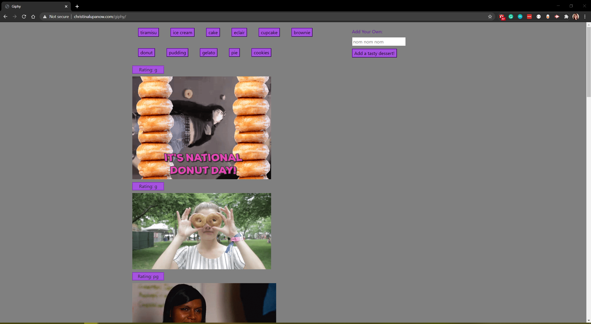

<!-- PROJECT SHIELDS -->

[![Contributors][contributors-shield]][contributors-url] [![Forks][forks-shield]][forks-url] [![Stargazers][stars-shield]][stars-url] [![Issues][issues-shield]][issues-url] [![LinkedIn][linkedin-shield]][linkedin-url]

 
<h3 align="center">GIPHY</h3>
<p align="center">
This application uses the Giphy API to pull gifs and display them based on search parameters. It allows users to add their own search buttons. Gifs are displayed as static and can then be clicked to animate. Click again to return to static.
<br />
<br />
<a href="https://celupanow.github.io/giphy">View Demo</a>
·
<a href="https://github.com/celupanow/giphy/issues">Report Bug</a>
·
<a href="https://github.com/celupanow/giphy/issues">Request Feature</a>

</p>

</p>
<!-- TABLE OF CONTENTS -->

## Table of Contents

* [About the Project](#about-the-project)
	* [Built With](#built-with)
* [Getting Started](#getting-started)
	* [Prerequisites](#prerequisites)
	* [Installation](#installation)
* [Roadmap](#roadmap)
* [Contact](#contact)
* [Acknowledgements](#acknowledgements)

  
  
  

<!-- ABOUT THE PROJECT -->

## About The Project


### Built With
* [HTML](https://developer.mozilla.org/en-US/docs/Learn/HTML)
* [CSS](https://developer.mozilla.org/en-US/docs/Web/CSS)
* [Bootstrap](https://getbootstrap.com/)
* [Javascript](https://developer.mozilla.org/en-US/docs/Web/JavaScript)
* [jQuery](https://jquery.com)
* [AJAX](https://developer.mozilla.org/en-US/docs/Web/Guide/AJAX)
* [Giphy API](https://developers.giphy.com/)

<!-- GETTING STARTED -->

## Getting Started
To get a local copy up and running follow these simple steps.
  
### Installation
1. Get a free API Key at https://developers.giphy.com/

2. Clone the repo

```sh

git clone https://github.com/celupanow/giphy.git

```
3. Enter your API in config.js

```JS
var config = "ENTER YOUR API";
```
<!-- ROADMAP -->

## Roadmap

  

See the [open issues](https://github.com/celupanow/giphy/issues) for a list of proposed features (and known issues).

<!-- CONTACT -->

## Contact

  

Christina Lupanow - christina@christinalupanow.com

  

Project Link: [https://github.com/celupanow/giphy](https://github.com/celupanow/giphy)

<!-- ACKNOWLEDGEMENTS -->

## Acknowledgements

  

* [GitHub Pages](https://pages.github.com)

<!-- MARKDOWN LINKS & IMAGES -->

<!-- https://www.markdownguide.org/basic-syntax/#reference-style-links -->

[contributors-shield]: https://img.shields.io/github/contributors/celupanow/giphy.svg?style=flat-square

[contributors-url]: https://github.com/celupanow/giphy/graphs/contributors

[forks-shield]: https://img.shields.io/github/forks/celupanow/giphy.svg?style=flat-square

[forks-url]: https://github.com/celupanow/giphy/network/members

[stars-shield]: https://img.shields.io/github/stars/celupanow/giphy.svg?style=flat-square

[stars-url]: https://github.com/celupanow/giphy/stargazers

[issues-shield]: https://img.shields.io/github/issues/celupanow/giphy.svg?style=flat-square

[issues-url]: https://github.com/celupanow/giphy/issues

[license-shield]: https://img.shields.io/github/license/celupanow/giphy.svg?style=flat-square

[license-url]: https://github.com/celupanow/giphy/blob/master/LICENSE.txt

[linkedin-shield]: https://img.shields.io/badge/-LinkedIn-black.svg?style=flat-square&logo=linkedin&colorB=555

[linkedin-url]: https://linkedin.com/in/celupanow

[product-screenshot]: images/screenshot.png
<!--stackedit_data:
eyJoaXN0b3J5IjpbNTM5NzU2MjExLC0xNDI4MjY5MTM0LC0xNz
Q0MTc3NjU2LDQwOTc3NDMxMywtMTY2NzUxNDA4OSwxNjg1MjA4
NDQxLC0yMDUyODEzODYxLDIzMjUyNDUzMCwyMTE0MDc3NjMxLC
04MTA0MDc3NjEsMjA1MDA3Njk0N119
-->